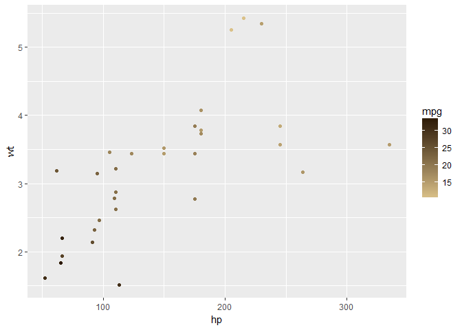
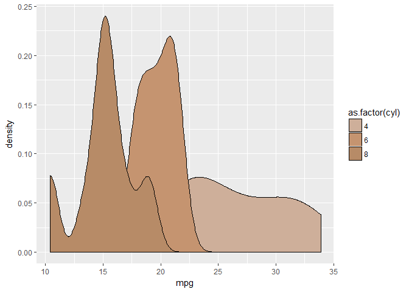

README
================

<!-- badges -->
[](https://cran.r-project.org/package=coffeegeeks)[](/commits/master) [](http://www.repostatus.org/#concept) [](http://choosealicense.com/licenses/mit/)

It is written in the stars, that when a twitter hashtag is created, a community is born. As is true for the [\#rstatscoffeegeeks community](https://twitter.com/search?q=%23rstatscoffeegeeks).

This package contains basic needs for every rstatscoffeegeek.

-   an rmarkdowndocument template with coffee colors and image
-   a ggplot2 coffee theme
-   basic help for when your coffee doesn't taste great
-   coffee related emojis
-   coffee names

Install this package with `devtools::install_github("rmhogervorst/coffeegeeks")`

### How to use the template

To use the coffee rmarkdown template, install the package and go 'create new rmarkdown document'


Then in the dialog select Coffee theme


After knitting, the endresult looks something like this:


Using the ggplot2 theme
-----------------------

``` r
library(coffeegeeks)
library(ggplot2)
ggplot(mtcars)+
    geom_point(aes(hp, wt, color = mpg))+
    scale_gradient_coffee()
```



``` r
ggplot(mtcars)+
    geom_density(aes(mpg, fill = as.factor(cyl)))+
    scale_fill_coffee()
```



Diagnosing your coffee problems
-------------------------------

Use the function `help_my_coffee_` .

``` r
help_my_coffee_(tastes = "bitter")
```

    ## A bitter flavour is often the result of extracting too much from the grounds.

    ##   adjust your grind or timing:

    ##   - make your grind courser AND/ OR let your coffee pass faster

    ## coarsening your grind will slow the process of extraction and allow you to find the right balance of flavor.

Collaborating
-------------

Are you passionate about coffee? Do you want to help out? The development of this package is all online on github.

-   open an issue [new issue](https:://github.com/coffeegeeks/issues/new) if you'd like to suggest a new addition
-   add new stuff with a [pull request](https://github.com/RMHogervorst/coffeegeeks/compare)
