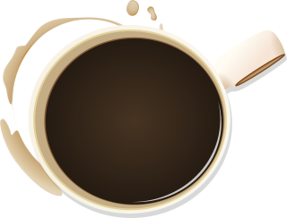

<!-- This line below shows you the coffee logo -->


```{r setup, include=FALSE}
knitr::opts_chunk$set(echo = TRUE)
```


# This is a heading 1

Followed by a paragraph

And another paragraph.

> Coffee is quite OK (a quote)

## A heading 2 should be smaller

## Heading 3 is even smaller

### Heading 4 is the smallest (although you could probably go smaller)


# Coffee in the Morning Time
 
> By Maren Beachamp (2017)

The classic idea,
At least in the mainstream,
Is that someone's love 
Is supposed to make you feel buzzed,
Maybe even drunk.
You're supposed to be happy,
Giddy,
Maybe even 
A little bit tipsy.

Well, your love -
Or...more like...
Your presence, 
I should probably say -
That,
That doesn't make me drunk at all.
Not even a little bit.
Nah,
You're more like
A cold cup of coffee
In the morning.

Seeing you wakes me up
In the best type of way.
Sure, you make me happy,
But not in the drunk, obnoxious sort of way.
More like the softer, foolish sort of array.
I'm alive, awake, and energetic.
But, I'm me.
I'm always me when I'm with you.
In fact,
I like to think
I'm even more so me.

It's like 
All of the thoughts 
Become so clear
When you're here.

Much like the slight anxiety
That comes along with the caffeine,
I used to get nerves
Whenever you could be seen.
- and not like "the butterflies," anticipation sort of deal;
more like the about to vomit,
choking on my words sort of appeal -
But now,
Now, you're just
The talkative, cheery part 
Of the coffee to me.
And I'd take 
An ice cold coffee over a beer 
Any day.

So, I wouldn't say 
You make me drunk.
Not even a little bit.
- i mean,
i'm a rather emotional
sort of drunk... -
So, nah,
You don't compare to the alcohol 
And the nighttime.
You're more like 
The sun rising,
Fog settling,
And drizzle starting -
Coffee in the morning time.

